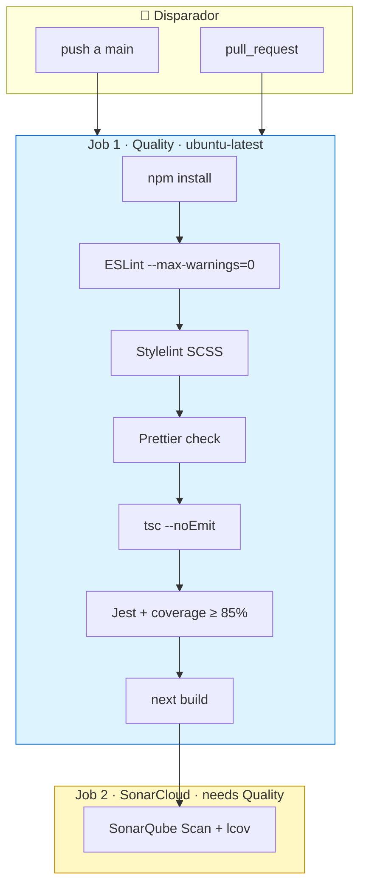
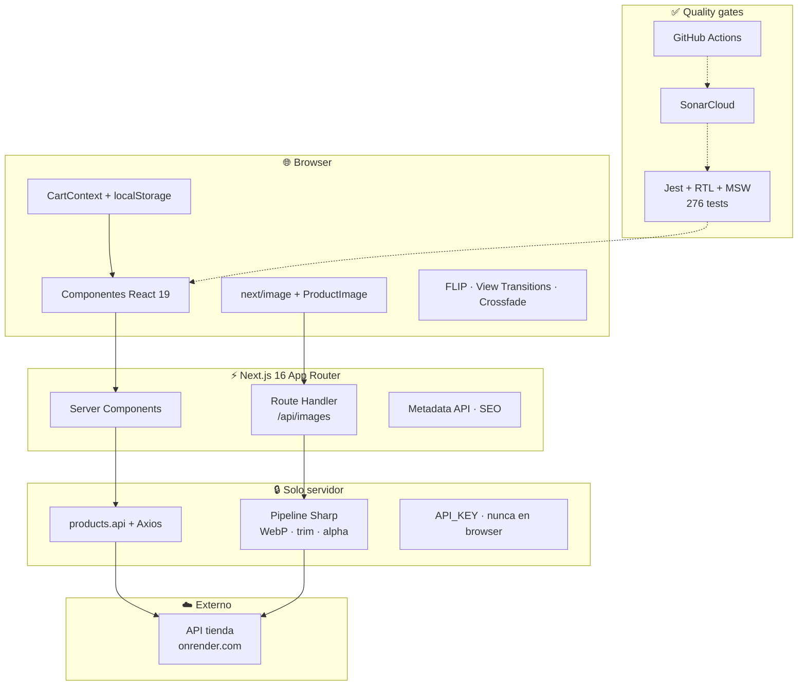

# Zara Mobile Catalog

<p align="center">
  <a href="https://github.com/CristinaFores/zara-mobile-challenge/actions/workflows/ci.yml"></a>
  <a href="https://sonarcloud.io/summary/new_code?id=CristinaFores_zara-mobile-challenge"></a>
</p>

<p align="center">
  <a href="https://sonarcloud.io/summary/new_code?id=CristinaFores_zara-mobile-challenge"></a>
</p>

<p align="center">
  <a href="https://sonarcloud.io/summary/new_code?id=CristinaFores_zara-mobile-challenge"></a>
  <a href="https://sonarcloud.io/summary/new_code?id=CristinaFores_zara-mobile-challenge"></a>
  <a href="https://sonarcloud.io/summary/new_code?id=CristinaFores_zara-mobile-challenge"></a>
  <a href="https://sonarcloud.io/summary/new_code?id=CristinaFores_zara-mobile-challenge"></a>
  <a href="https://sonarcloud.io/summary/new_code?id=CristinaFores_zara-mobile-challenge"></a>
</p>

<p align="center">
  
  
  
  
</p>

Catálogo de smartphones de nivel producción para la prueba técnica Zara / Inditex.
Listado, búsqueda, configuración de variantes y carrito persistente — con **linters estrictos,
GitHub Actions CI y SonarCloud** en cada pull request.

**Idiomas:** [English](./README.md) · [Español](./README.es.md)

---

## Linters y GitHub Actions

Cada cambio pasa gates **locales** y en **CI**. Nada mergea sin pasar todos los checks.

### Linters (local + CI)

<p align="center">
  
  
  
  
  
</p>

| Herramienta    | Comando                | Config              | Qué valida                                        |
| -------------- | ---------------------- | ------------------- | ------------------------------------------------- |
| **ESLint**     | `npm run lint`         | `eslint.config.mjs` | Reglas TS/React/Next, imports, `--max-warnings=0` |
| **Stylelint**  | `npm run lint:styles`  | `.stylelintrc`      | SCSS BEM, sin colores hardcodeados                |
| **Prettier**   | `npm run format:check` | `.prettierrc`       | Formato en TS/TSX/SCSS/JSON/MD                    |
| **TypeScript** | `npm run typecheck`    | `tsconfig.json`     | Modo `strict`, sin emit                           |

**Cuándo corren**

| Etapa                  | Qué ejecuta                                                                    |
| ---------------------- | ------------------------------------------------------------------------------ |
| **pre-commit** (Husky) | lint-staged → Prettier + ESLint en TS/TSX staged; Stylelint + Prettier en SCSS |
| **pre-push** (Husky)   | typecheck → lint → lint:styles → format:check → test → build                   |
| **GitHub Actions**     | Los mismos gates + coverage + SonarCloud                                       |

### GitHub Actions CI

<p align="center">
  <a href="https://github.com/CristinaFores/zara-mobile-challenge/actions/workflows/ci.yml">
    
  </a>
</p>

Workflow: [`.github/workflows/ci.yml`](./.github/workflows/ci.yml) — dispara en **push** y **pull_request** a `main`.



| Job            | Pasos                                                                          | Bloquea merge |
| -------------- | ------------------------------------------------------------------------------ | ------------- |
| **Quality**    | install → ESLint → Stylelint → Prettier → typecheck → tests + coverage → build | ✅            |
| **SonarCloud** | historial git → coverage → análisis estático                                   | ✅            |

**Secrets:** `API_KEY` · `SONAR_TOKEN`

---

## Índice

|     | Sección                                                                |
| --- | ---------------------------------------------------------------------- |
| 🔍  | [Linters y GitHub Actions](#linters-y-github-actions)                  |
| 📱  | [Alcance funcional](#alcance-funcional)                                |
| 🔗  | [Estado en URL (query params)](#estado-en-url-query-params)            |
| 🛒  | [Integridad del carrito](#integridad-del-carrito)                      |
| 🧱  | [Stack tecnológico](#stack-tecnológico-y-por-qué)                      |
| 🖼️  | [Imágenes: pipeline y optimización](#imágenes-pipeline-y-optimización) |
| ✨  | [Motion y fidelidad Figma](#motion-y-fidelidad-figma)                  |
| 🏗️  | [Arquitectura](#arquitectura)                                          |
| ✅  | [Ingeniería de calidad](#ingeniería-de-calidad)                        |
| 🎭  | [Tests end-to-end (Playwright)](#tests-end-to-end-playwright)          |
| ♿  | [Accesibilidad y SEO](#accesibilidad-y-seo)                            |
| ⚡  | [Inicio rápido](#inicio-rápido)                                        |
| 📜  | [Scripts](#scripts)                                                    |

---

## Alcance funcional

| Vista    | Ruta             | Comportamiento                                                                                     |
| -------- | ---------------- | -------------------------------------------------------------------------------------------------- |
| Catálogo | `/`              | Grid (límite 20), búsqueda en vivo, contador de resultados, animaciones FLIP                       |
| Detalle  | `/products/[id]` | Imagen hero, selectores color/almacenamiento, precio dinámico, specs, similares, añadir al carrito |
| Carrito  | `/cart`          | Líneas, eliminación, total, seguir comprando                                                       |

---

## Estado en URL (query params)

Todo lo que debe sobrevivir a refresh, atrás/adelante y enlaces compartibles va en la URL.

### Búsqueda en catálogo — `/?search=`

| Aspecto        | Implementación                                                                                    |
| -------------- | ------------------------------------------------------------------------------------------------- |
| Debounce       | 300 ms (`SEARCH_DEBOUNCE_MS`) antes de navegar                                                    |
| Fetch servidor | Home lee `searchParams.search` y llama a la API con `?search=` — **sin filtrado solo en cliente** |
| Sync URL       | Al escribir se actualiza `/?search=<encoded>`; query vacía limpia el param                        |
| Historial      | Atrás/adelante restaura el input vía sync de `initialQuery` sin remount del grid (FLIP intacto)   |

**Tests:** `useCatalogSearch.test.ts`, `page.test.tsx`, `ProductCatalog.test.tsx`, `SearchBar.test.tsx`

### Configuración de producto — `/products/[id]?color=&storage=`

| Aspecto    | Implementación                                                               |
| ---------- | ---------------------------------------------------------------------------- |
| Lectura    | `useProductSelection` resuelve `color` y `storage` desde `useSearchParams()` |
| Escritura  | Al elegir chip → `router.replace` con params actualizados (`scroll: false`)  |
| Precio     | `storageOptions[].price` define el importe; sin storage → “From X EUR”       |
| Añadir     | Bloqueado hasta que **ambos** params apuntan a opciones válidas              |
| Deep links | Cada línea del carrito enlaza al detalle con los mismos `color` + `storage`  |

**Tests:** `useProductSelection.test.ts`, `StorageSelector.test.tsx`, `ColorSelector.test.tsx`, `ProductDetailHero.test.tsx`

---

## Integridad del carrito

### Persistencia e identidad

- Clave por **id + color + almacenamiento** (`buildKey`) — mismo móvil, dos configs = dos líneas.
- `localStorage` vía `cartStorage` (seguro en SSR, JSON validado al leer, fallback si quota/modo privado).
- Hidratación tras mount; cero acceso a storage en render servidor.

### Actualizaciones

| Acción       | Reducer                                            | Con test               |
| ------------ | -------------------------------------------------- | ---------------------- |
| Añadir       | `ADD` — precio de la storage elegida en el momento | `CartContext.test.tsx` |
| Eliminar     | `REMOVE` por clave de línea                        | ✓                      |
| Vaciar       | `CLEAR`                                            | ✓                      |
| Sync precios | `SYNC_PRICES` + `syncPrices(updates)` público      | ✓                      |

**Reconciliación de precios:** cada línea guarda el precio al añadir. `syncPrices` recibe un mapa clave → precio actual y recalcula `cartTotal`. Reducer y contexto cubiertos con tests BDD; conectar un re-fetch al abrir el carrito contra `GET /products/:id` es una capa fina sobre esta API.

**Stock / disponibilidad:** la API del reto **no expone inventario**. La disponibilidad se infiere así:

- Catálogo: el producto está en la respuesta de `GET /products`.
- Detalle: id inválido o borrado → `ProductNotFoundError` / 404 (`loadProduct`, validación de id en `products.api`).
- Carrito: las líneas permanecen hasta que el usuario las quita; `syncPrices` + re-fetch opcional detectan configs obsoletas si cambia el upstream.

**Tests:** `CartContext.test.tsx`, `cartStorage.test.ts`, `buildKey.test.ts`, `CartView.test.tsx`

---

## Stack tecnológico y por qué

### Vista rápida

<p align="center">
  <a href="https://nextjs.org"></a>
  <a href="https://react.dev"></a>
  <a href="https://www.typescriptlang.org"></a>
  <a href="https://sass-lang.com"></a>
  <a href="https://jestjs.io"></a>
  <a href="https://www.mswjs.io"></a>
  <a href="https://sharp.pixelplumbing.com"></a>
  <a href="https://sonarcloud.io"></a>
</p>



| Capa      | Tecnología                                                                                | Versión | Por qué                                                                                                                     |
| --------- | ----------------------------------------------------------------------------------------- | ------- | --------------------------------------------------------------------------------------------------------------------------- |
| Framework | [Next.js](https://nextjs.org) App Router                                                  | 16      | SSR, metadata, route handlers, [`next/image`](https://nextjs.org/docs/app/building-your-application/optimizing/images), SEO |
| UI        | [React](https://react.dev)                                                                | 19      | Componentes, rendering concurrente                                                                                          |
| Lenguaje  | [TypeScript](https://www.typescriptlang.org) strict                                       | 5.7     | Contrato tipado, refactors seguros, sin `any`                                                                               |
| Estilos   | [Sass](https://sass-lang.com) + BEM + CSS Modules                                         | —       | Scoped, [tokens](./src/scss/_variables.scss), mobile-first                                                                  |
| Estado    | Context API + reducer                                                                     | —       | Solo carrito — sin Redux                                                                                                    |
| HTTP      | [Axios](https://axios-http.com)                                                           | 1.18    | Aislado en [`products.api`](./src/shared/services/products.api.ts)                                                          |
| Imágenes  | [Sharp](https://sharp.pixelplumbing.com) + [`/api/images`](./src/app/api/images/route.ts) | 0.34    | Ver [pipeline de imágenes](#imágenes-pipeline-y-optimización)                                                               |
| Tests     | [Jest](https://jestjs.io) + [RTL](https://testing-library.com) + [MSW](https://mswjs.io)  | 30      | BDD; red en capa HTTP                                                                                                       |
| Lint      | ESLint + Prettier + Stylelint                                                             | 9       | Cero warnings                                                                                                               |
| Hooks     | Husky + lint-staged                                                                       | 9 / 17  | pre-commit + pre-push                                                                                                       |
| CI        | [GitHub Actions](./.github/workflows/ci.yml) + [SonarCloud](https://sonarcloud.io)        | —       | Cada PR gateado                                                                                                             |
| E2E       | [Playwright](https://playwright.dev)                                                      | 1.61    | Tests en `e2e/` — catálogo, detalle, carrito ([guía E2E](#tests-end-to-end-playwright))                                     |

**Omitido a propósito:** TanStack Query · Redux/Zustand · Tailwind.

Variables solo servidor (nunca `NEXT_PUBLIC_`):

```env
API_BASE_URL=https://prueba-tecnica-api-tienda-moviles.onrender.com
API_KEY=your-api-key
```

---

## Imágenes: pipeline y optimización

> 🔗 Ver también: [Stack tecnológico](#stack-tecnológico-y-por-qué) · [Motion Figma](#motion-y-fidelidad-figma) · [`ProductImage`](./src/shared/components/ProductImage/ProductImage.tsx) · [`imageProcessing.ts`](./src/shared/lib/imageProcessing.ts)

Las imágenes upstream son remotas, grandes y con fondo blanco — malas para LCP, CLS y el look Figma (hero transparente sobre gris).

### Por qué un proxy servidor (`/api/images`)

| Problema                          | Solución                                                       |
| --------------------------------- | -------------------------------------------------------------- |
| La API key no puede ir al browser | El cliente nunca pide assets crudos; el proxy fetchea upstream |
| Riesgo SSRF                       | Allowlist de host + check de protocolo                         |
| Sharp repetido                    | Caché en proceso (~200 entradas, url + width + quality)        |
| onrender.com lento                | Cache-Control immutable + caché caliente en revisitas          |

### Pipeline (Sharp)

```mermaid
flowchart LR
  A["🖼️ PNG/WebP upstream<br/>fondo blanco"] --> B["🔐 /api/images<br/>allowlist SSRF"]
  B --> C["📥 fetchRemoteImage"]
  C --> D["🎨 ensureAlpha"]
  D --> E["⬜ flood-fill bordes<br/>→ transparente"]
  E --> F["✂️ trim + resize"]
  F --> G["📦 salida WebP"]
  G --> H["💾 caché 200 entradas"]
  H --> I["⚡ next/image<br/>LCP eager"]

  style A fill:#f5f5f5,stroke:#333
  style G fill:#4ade80,stroke:#166534
  style I fill:#60a5fa,stroke:#1e40af
```



| Paso                    | Para qué                                                              |
| ----------------------- | --------------------------------------------------------------------- |
| Flood-fill en bordes    | Quita blanco conectado al borde; preserva blancos internos (pantalla) |
| Trim + contain          | Encuadre consistente card/hero según Figma                            |
| WebP                    | Payload menor que el PNG/WebP original de la API                      |
| Límite concurrencia (3) | Sharp no satura el thread-pool de libuv                               |
| Loader custom           | `ProductImage` pasa todo por `buildProxyUrl` — un solo camino         |

### Cliente (`next/image`)

- `sizes` responsive por contexto (grid, hero, similares).
- Carga eager en cards above-the-fold y hero del detalle (LCP).
- Fallback SVG si falta o falla el `src` — el crossfade termina igual.
- `useColorVariantPreload` — precarga otras URLs de color a 640 / 828 px antes del cambio.

**Tests:** `ProductImage.test.tsx`, `imageProcessing.test.ts`, `app/api/images/route.test.ts`

---

## Motion y fidelidad Figma

> 🔗 Ver también: [Pipeline imágenes](#imágenes-pipeline-y-optimización) · [`globals.scss`](./src/scss/globals.scss) · [Figma del reto](https://www.figma.com/design/Nuic7ePgOfUQ0hcBrUUQrb/Labs---Zara-Web-Challenge--Smartphones-)

Animaciones alineadas con el Figma del reto. Respetan `prefers-reduced-motion: reduce` donde se usa View Transitions API.

| Intención Figma                      | Implementación                                                      | Dónde                                              |
| ------------------------------------ | ------------------------------------------------------------------- | -------------------------------------------------- |
| Barra de carga superior al entrar    | Barra CSS ~1.2 s (estática en carrito)                              | `Header`                                           |
| Reflow del grid al buscar            | FLIP — cards que salen animan out, entradas desde posición anterior | `useFlipAnimation`, `flip.ts`, `ProductList`       |
| Imagen compartida catálogo → detalle | View Transitions API + `viewTransitionName`                         | `ProductCard`, `ProductDetailHero`, `globals.scss` |
| Hero instantáneo mientras carga ruta | `loading.tsx` muestra preview del catálogo                          | `app/products/[id]/loading.tsx`                    |
| Cambio de color sin flash            | Crossfade dual-slot (`useImageCrossfade`)                           | `ProductDetailHero`                                |
| Actualización precio / nombre color  | Crossfade de texto (`useTextCrossfade`)                             | hero + `ColorSelector`                             |
| Carrusel similares                   | `ScrollRow` con drag horizontal                                     | `SimilarProducts`                                  |
| Timing transición                    | Easing `cubic-bezier(0.22, 1, 0.36, 1)` ~520 ms                     | `globals.scss`                                     |

El store `productNavigation` guarda brand/nombre/imagen entre el click en catálogo y el mount del detalle.

**Tests:** `useFlipAnimation.test.tsx`, `flip.test.ts`, `useImageCrossfade.test.ts`, `useTextCrossfade.test.ts`, `loading.test.tsx`, `ProductCard.test.tsx`

---

## Arquitectura

Organización por features — dominio en `features/`, transversal en `shared/`.

```
src/
├── app/                    Páginas, layout, error/loading, route handlers
├── features/
│   ├── catalog/            Búsqueda, grid, FLIP, useCatalogSearch
│   ├── product-detail/     Hero, selectores, useProductSelection, crossfade
│   └── cart/               Context, reducer, CartView, cartStorage
├── shared/                 Componentes, services, lib, hooks, types, constants
├── scss/                   Tokens, reset, mixins
└── test-utils/             Handlers MSW, fixtures
```

**Flujo de datos**

- Server components → `products.service` → `products.api` → API upstream con `x-api-key`.
- Route handler `/api/images` hace proxy y optimiza imágenes (Sharp).
- Búsqueda cliente empuja query params; el servidor re-renderiza con lista fresca.
- Selección en detalle empuja `color` / `storage`; sin estado duplicado solo en cliente.

---

## Ingeniería de calidad

La calidad es entregable, no un extra.

### Suite de tests

| Métrica         | Valor                                                                      |
| --------------- | -------------------------------------------------------------------------- |
| Runner          | Jest 30 + React Testing Library                                            |
| Estilo          | BDD — cada `describe` / `it` en Given → When → Then / And                  |
| Red             | MSW v2 en `src/test-utils/msw/handlers.ts`                                 |
| Fixtures        | `src/test-utils/fixtures/products.fixtures.ts`                             |
| Suites          | 47 · 276 tests                                                             |
| Umbral coverage | ≥ 85 % lines / functions / statements · ≥ 80 % branches (`jest.config.js`) |

**Qué cubrimos (ejemplos):**

- Round-trip URL de búsqueda y navegación con debounce
- Lectura/escritura de query params color/storage y guard de add-to-cart
- Añadir, quitar, persistencia, storage corrupto, recálculo de total con `syncPrices`
- Proxy de imágenes, validación de id, `encodeURIComponent`
- FLIP, view transitions, crossfade de imágenes
- Labels accesibles, `aria-pressed`, anuncio live al añadir al carrito

**Comandos:**

```bash
npm run test
npm run test:coverage
npm run test:e2e          # Playwright — ver [sección E2E](#tests-end-to-end-playwright)
```

Gate de entrega:

```bash
npm run typecheck && npm run lint && npm run test && npm run build
```

### Análisis estático — SonarCloud

| Item     | Detalle                                                            |
| -------- | ------------------------------------------------------------------ |
| Config   | `sonar-project.properties`                                         |
| Coverage | `coverage/lcov.info` desde `npm run test:coverage`                 |
| Job CI   | `SonarCloud analysis` en `.github/workflows/ci.yml` (tras quality) |
| Secret   | `SONAR_TOKEN` en GitHub                                            |
| Alcance  | Código nuevo en PRs; análisis completo en `main`                   |

Sonar corre en cada PR junto a ESLint (`--max-warnings=0`), Stylelint, Prettier, typecheck, tests y build de producción. Las métricas en vivo están en la fila de badges al inicio de este README.

### Tests end-to-end (Playwright)

Tests de browser en `e2e/` contra la app real y la API del challenge (`.env.local`). Complementan Jest/MSW — sin mock de axios en E2E.

| Métrica | Valor                                                                                     |
| ------- | ----------------------------------------------------------------------------------------- |
| Runner  | [Playwright](https://playwright.dev) 1.61                                                 |
| Estilo  | BDD — `Given / When / Then` en cada `test()`                                              |
| Config  | [`playwright.config.ts`](./playwright.config.ts) — `chromium` + `mobile-chrome` (Pixel 5) |
| Specs   | 3 archivos · **23 escenarios** por proyecto · **46 en total** en headless                 |
| Helpers | [`e2e/helpers.ts`](./e2e/helpers.ts) — id dinámico desde el grid, selección color/storage |

**Alcance por archivo**

| Archivo               | Tests | Cubre                                                                                       |
| --------------------- | ----- | ------------------------------------------------------------------------------------------- |
| `e2e/listing.spec.ts` | 6     | Grid, contenido de card, búsqueda / vacío / limpiar, navegación a `/products/[id]`          |
| `e2e/detail.spec.ts`  | 9     | Hero + add, disabled sin config, selectores, precio, race de selección, add → `/cart`, back |
| `e2e/cart.spec.ts`    | 8     | Carrito vacío, líneas + total, eliminar, persistencia `localStorage`, logo y enlace carrito |

Rutas: `/` · `/products/:id` · `/cart` (no `/phones`).

**Primera vez**

```bash
npm run playwright:install   # Chromium + headless shell — espera al 100% en ambas descargas
cp .env.example .env.local     # API_KEY necesario para listado y detalle
```

`playwright:install` **no** se ejecuta con `npm install` — una vez por máquina (o tras actualizar `@playwright/test`).

**Qué comando usar**

| Objetivo                          | Comando                                        | Qué ves                                                    |
| --------------------------------- | ---------------------------------------------- | ---------------------------------------------------------- |
| Verificación rápida (recomendado) | `npm run test:e2e`                             | Headless, paralelo — **46 tests**                          |
| Ver Chrome mientras corre         | `npm run test:e2e:headed`                      | Headed, 1 worker — **23 chromium**; parpadeos rápidos      |
| Paso a paso en un archivo         | `npm run test:e2e:debug -- e2e/detail.spec.ts` | Inspector + Chrome — ver abajo                             |
| Explorar / re-ejecutar            | `npm run test:e2e:ui`                          | UI Playwright — **no arranca solo**; pulsa ▶ (23 chromium) |

**`npm run test:e2e:ui`**

1. Arranca `npm run dev` en :3000 (o reutiliza servidor existente).
2. Abre la ventana **Playwright Test UI** (aparte de Chrome).
3. **Pulsa ▶** arriba del panel izquierdo — sin eso no corre nada.
4. Verde = OK, rojo = fallo. Pestaña Errors en fallos.

El script usa `PLAYWRIGHT_TRACING_NO_WEBSOCKET_FRAMES=1` (bug zip en Node 24). Si persiste: cierra la UI, `rm -rf test-results playwright-report`, `npm run test:e2e:ui`.

**`npm run test:e2e:debug` — ¿navegador en blanco?**

Normal hasta continuar. Se abren **dos** ventanas:

1. **Playwright Inspector** (▶ Resume, Step, Pick locator).
2. **Chrome** — en blanco con el test **pausado al inicio**.

Pulsa **▶ Resume** (o F8) en el **Inspector**:

```bash
npm run test:e2e:debug -- e2e/detail.spec.ts
```

**Avisos de hydration en terminal (`data-pw-cursor` en `<body>`)**

En `--debug`, Playwright inyecta `data-pw-cursor` en `<body>` para el cursor del Inspector. React registra hydration mismatch en el dev server (`[WebServer] A tree hydrated but...`). **Es normal en debug**, no es un bug de la app. En `npm run test:e2e` headless y en producción no aparece. Ignóralo mientras depuras.

**Headed va muy rápido**

Headed no va lento para mirar — usa UI en un test o debug en un archivo.

**Problemas frecuentes**

| Error                      | Solución                                                        |
| -------------------------- | --------------------------------------------------------------- |
| `Executable doesn't exist` | `npm run playwright:install` (sin punto: no `chromium.`)        |
| Puerto 3000 ocupado        | `lsof -ti:3000 \| xargs kill -9` y reintenta                    |
| Zip truncado en UI         | `rm -rf test-results playwright-report` y `npm run test:e2e:ui` |

**Flags extra** — después de `--` va a Playwright:

```bash
npm run test:e2e -- --project=chromium e2e/cart.spec.ts
```

**CI / hooks:** E2E **no** está en GitHub Actions ni en pre-push de Husky. Gate local:

```bash
npm run test:e2e
```

### Hooks git locales

| Hook       | Ejecuta                                                      |
| ---------- | ------------------------------------------------------------ |
| pre-commit | lint-staged (Prettier + ESLint en TS/TSX, Stylelint en SCSS) |
| pre-push   | typecheck, lint, lint:styles, format:check, test, build      |

---

## Accesibilidad y SEO

- Landmarks semánticos, un `h1` por página, metadata Next.js (títulos dinámicos en detalle).
- Botones y enlaces reales, `aria-pressed` en selectores, región live al añadir al carrito.
- Fuente Helvetica / Arial / sans-serif según spec.

---

## Inicio rápido

**Requisitos:** Node.js ≥ 20 · npm ≥ 10

```bash
npm install
npm run playwright:install   # solo la primera vez — browsers E2E
cp .env.example .env.local
npm run dev
```

Abrir `http://localhost:3000`.

**Producción:**

```bash
npm run build
npm run start
```

Deploy en cualquier host Node o Vercel con las mismas variables de entorno servidor.

---

## Scripts

| Script                            | Propósito                      |
| --------------------------------- | ------------------------------ |
| `npm run dev`                     | Servidor de desarrollo         |
| `npm run build` / `start`         | Build y serve producción       |
| `npm run typecheck`               | `tsc --noEmit`                 |
| `npm run lint`                    | ESLint, cero warnings          |
| `npm run lint:styles`             | Stylelint en SCSS              |
| `npm run format` / `format:check` | Prettier                       |
| `npm run test`                    | Jest                           |
| `npm run test:coverage`           | Jest + lcov para SonarCloud    |
| `npm run playwright:install`      | Descargar Chromium Playwright  |
| `npm run test:e2e`                | E2E headless (todos)           |
| `npm run test:e2e:headed`         | E2E headed, chromium, 1 worker |
| `npm run test:e2e:debug`          | E2E con Playwright Inspector   |
| `npm run test:e2e:ui`             | E2E UI interactiva (▶ manual)  |

---

**Resumen:** Next.js para SEO e imágenes · TypeScript strict · Sass + BEM · Context + carrito en localStorage ·
Proxy Sharp · motion alineado con Figma (FLIP, view transitions, crossfade) · query params ·
276 tests BDD + SonarCloud · E2E con Playwright · accesibilidad y SEO como requisitos core.
