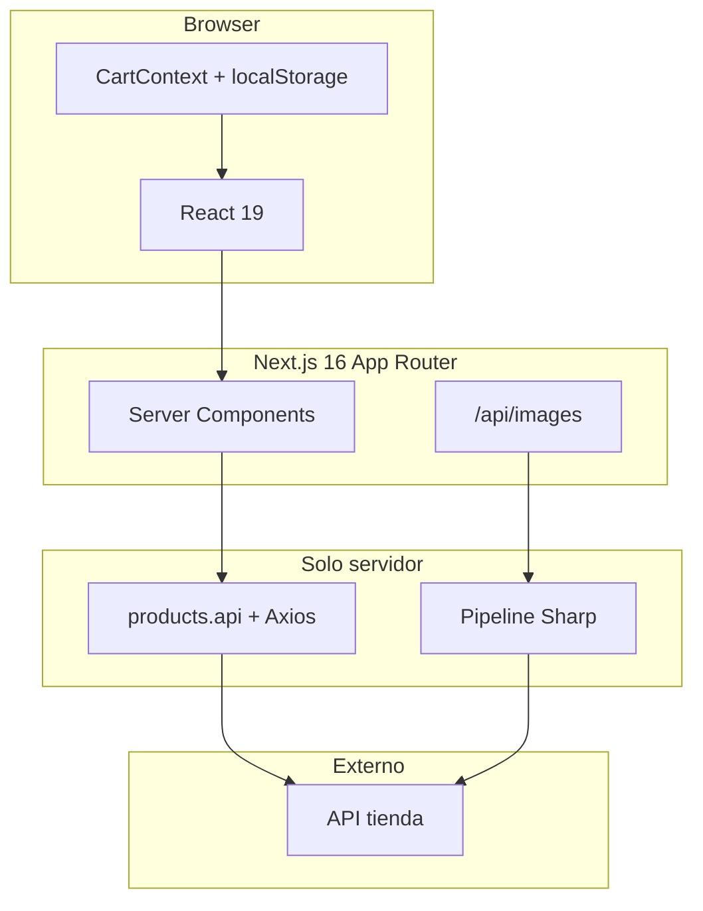
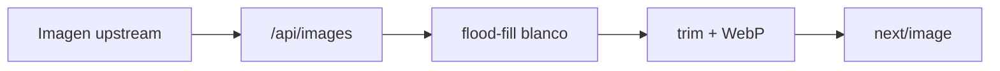
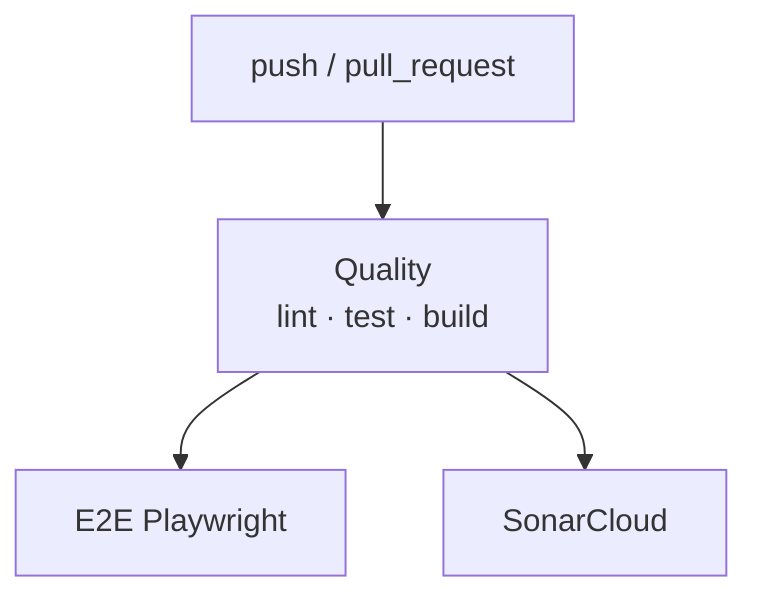

# Zara Mobile Catalog

|                                                                                         CI                                                                                          |                                                                              Sonar                                                                               |                                                     Tests                                                      |                                              Coverage gate                                              |                                                       TypeScript                                                       |                                                      ESLint                                                      |
| :---------------------------------------------------------------------------------------------------------------------------------------------------------------------------------: | :--------------------------------------------------------------------------------------------------------------------------------------------------------------: | :------------------------------------------------------------------------------------------------------------: | :-----------------------------------------------------------------------------------------------------: | :--------------------------------------------------------------------------------------------------------------------: | :--------------------------------------------------------------------------------------------------------------: |
| [](https://github.com/CristinaFores/zara-mobile-challenge/actions/workflows/ci.yml) | [](https://sonarcloud.io/summary/new_code?id=CristinaFores_zara-mobile-challenge) |  |  |  |  |

|                                                                                            Quality gate                                                                                             |                                                                                                  Coverage                                                                                                  |                                                                                                Bugs                                                                                                |                                                                                                   Code smells                                                                                                    |                                                                                                          Duplicated lines                                                                                                          |
| :-------------------------------------------------------------------------------------------------------------------------------------------------------------------------------------------------: | :--------------------------------------------------------------------------------------------------------------------------------------------------------------------------------------------------------: | :------------------------------------------------------------------------------------------------------------------------------------------------------------------------------------------------: | :--------------------------------------------------------------------------------------------------------------------------------------------------------------------------------------------------------------: | :--------------------------------------------------------------------------------------------------------------------------------------------------------------------------------------------------------------------------------: |
| [](https://sonarcloud.io/summary/new_code?id=CristinaFores_zara-mobile-challenge) | [](https://sonarcloud.io/summary/new_code?id=CristinaFores_zara-mobile-challenge) | [](https://sonarcloud.io/summary/new_code?id=CristinaFores_zara-mobile-challenge) | [](https://sonarcloud.io/summary/new_code?id=CristinaFores_zara-mobile-challenge) | [](https://sonarcloud.io/summary/new_code?id=CristinaFores_zara-mobile-challenge) |

Catálogo de smartphones para la prueba frontend de [Napptilus Tech Labs](https://www.napptilus.com/) — **Zara Web Challenge**.
Listado, búsqueda, configuración de variantes y carrito persistente — con linters estrictos,
GitHub Actions CI, SonarCloud y E2E con Playwright en cada pull request.

**App en producción:** [zara-mobile-challenge.vercel.app](https://zara-mobile-challenge.vercel.app/)

**Página de entrega:** [Entrega](https://zara-mobile-challenge.vercel.app/entrega)

**Autora:** Cristina Fores · [LinkedIn](https://www.linkedin.com/in/cristina-fores) · [Portfolio](https://cristinafores.dev)

**Idiomas:** [English](./README.md) · [Español](./README.es.md) · [AGENTS.md](./AGENTS.md) · [DESIGN.md](./DESIGN.md)

---

## Índice

|                       |                                                                                                                                                           |
| --------------------- | --------------------------------------------------------------------------------------------------------------------------------------------------------- |
| **App en producción** | [zara-mobile-challenge.vercel.app](https://zara-mobile-challenge.vercel.app/)                                                                             |
| **Página de entrega** | [Entrega](https://zara-mobile-challenge.vercel.app/entrega)                                                                                               |
| **Inicio**            | [Inicio rápido](#inicio-rápido) · [Setup GitHub](#setup-github) · [Scripts](#scripts)                                                                     |
| **Aplicación**        | [Alcance funcional](#alcance-funcional) · [Estado en URL](#estado-en-url-query-params) · [Carrito](#integridad-del-carrito)                               |
| **Arquitectura**      | [Stack](#stack-tecnológico-y-por-qué) · [Estructura](#arquitectura) · [Imágenes](#imágenes-pipeline-y-optimización) · [Motion](#motion-y-fidelidad-figma) |
| **Calidad**           | [Testing](#ingeniería-de-calidad) · [CI/CD](#cicd) · [E2E (Playwright)](#tests-end-to-end-playwright)                                                     |
| **Otros**             | [Accesibilidad y SEO](#accesibilidad-y-seo) · [Autora](#autora) · [Licencia](#licencia)                                                                   |

---

## Inicio rápido

**Requisitos:** Node.js ≥ 20 · npm ≥ 10

```bash
npm install
npm run playwright:install   # solo la primera vez — browsers E2E
cp .env.example .env.local     # rellena API_KEY
npm run dev
```

Abrir [http://localhost:3000](http://localhost:3000).

| Modo                | Comando                                                              |
| ------------------- | -------------------------------------------------------------------- |
| Desarrollo          | `npm run dev`                                                        |
| Producción          | `npm run build && npm run start`                                     |
| Gate local completo | `npm run typecheck && npm run lint && npm run test && npm run build` |
| E2E (igual que CI)  | `npm run test:e2e -- --project=chromium`                             |

**GitHub (fork / repo nuevo):** ver [Setup GitHub](#setup-github) para secrets y branch protection.

Variables solo servidor (nunca `NEXT_PUBLIC_`):

```env
API_BASE_URL=https://prueba-tecnica-api-tienda-moviles.onrender.com
API_KEY=your-api-key
```

---

## Alcance funcional

| Vista    | Ruta             | Comportamiento                                                                        |
| -------- | ---------------- | ------------------------------------------------------------------------------------- |
| Catálogo | `/`              | Grid (límite 20), búsqueda en vivo, contador, animaciones FLIP                        |
| Detalle  | `/products/[id]` | Hero, selectores color/almacenamiento, precio dinámico, specs, similares, add to cart |
| Carrito  | `/cart`          | Líneas, eliminación, total, seguir comprando                                          |

---

## Estado en URL (query params)

Todo lo que debe sobrevivir a refresh, atrás/adelante y enlaces compartibles va en la URL.

### Búsqueda en catálogo — `/?search=`

| Aspecto        | Implementación                                                                                    |
| -------------- | ------------------------------------------------------------------------------------------------- |
| Debounce       | 300 ms (`SEARCH_DEBOUNCE_MS`) antes de navegar                                                    |
| Fetch servidor | Home lee `searchParams.search` y llama a la API con `?search=` — **sin filtrado solo en cliente** |
| Sync URL       | Al escribir se actualiza `/?search=<encoded>`; query vacía limpia el param                        |
| Historial      | Atrás/adelante restaura el input sin remount del grid (FLIP intacto)                              |

**Tests:** `useCatalogSearch.test.ts`, `page.test.tsx`, `ProductCatalog.test.tsx`, `SearchBar.test.tsx`

### Configuración de producto — `/products/[id]?color=&storage=`

| Aspecto    | Implementación                                                               |
| ---------- | ---------------------------------------------------------------------------- |
| Lectura    | `useProductSelection` resuelve `color` y `storage` desde `useSearchParams()` |
| Escritura  | Al elegir chip → `router.replace` con params actualizados (`scroll: false`)  |
| Precio     | `storageOptions[].price` define el importe; sin storage → "From X EUR"       |
| Añadir     | Bloqueado hasta que **ambos** params apuntan a opciones válidas              |
| Deep links | Cada línea del carrito enlaza al detalle con los mismos `color` + `storage`  |

**Tests:** `useProductSelection.test.ts`, `StorageSelector.test.tsx`, `ColorSelector.test.tsx`, `ProductDetailHero.test.tsx`

---

## Integridad del carrito

### Persistencia e identidad

- Cada línea tiene un id único — el mismo móvil + misma config puede repetirse en varias filas; configs distintas también son filas separadas.
- `localStorage` vía `cartStorage` (seguro en SSR, JSON validado al leer, fallback si quota/modo privado).
- Hidratación tras mount; cero acceso a storage en render servidor.

### Actualizaciones

| Acción   | Reducer                                            | Con test               |
| -------- | -------------------------------------------------- | ---------------------- |
| Añadir   | `ADD` — precio de la storage elegida en el momento | `CartContext.test.tsx` |
| Eliminar | `REMOVE` por clave de línea                        | ✓                      |
| Vaciar   | `CLEAR`                                            | ✓                      |

**Comportamiento del precio:** cada línea guarda el precio elegido al añadir y mantiene ese snapshot en el carrito.

**Trabajo futuro (no implementado en este reto):** gestión real de stock/disponibilidad, flujo de checkout e integración de pasarela de pago.

**Tests:** `CartContext.test.tsx`, `cartStorage.test.ts`, `buildKey.test.ts`, `CartView.test.tsx`

---

## Stack tecnológico y por qué

<p align="center">
  <a href="https://nextjs.org"></a>
  <a href="https://react.dev"></a>
  <a href="https://www.typescriptlang.org"></a>
  <a href="https://sass-lang.com"></a>
  <a href="https://jestjs.io"></a>
  <a href="https://playwright.dev"></a>
  <a href="https://sonarcloud.io"></a>
</p>



| Capa      | Tecnología                                                                                | Por qué                                                            |
| --------- | ----------------------------------------------------------------------------------------- | ------------------------------------------------------------------ |
| Framework | [Next.js](https://nextjs.org) 16 App Router                                               | SSR, metadata, route handlers, `next/image`, SEO                   |
| UI        | [React](https://react.dev) 19                                                             | Componentes, ecosistema Next.js                                    |
| Lenguaje  | [TypeScript](https://www.typescriptlang.org) strict                                       | Contrato tipado, sin `any`                                         |
| Estilos   | [Sass](https://sass-lang.com) + BEM + CSS Modules                                         | Scoped, [tokens](./src/scss/_variables.scss)                       |
| Estado    | Context API + reducer                                                                     | Solo carrito                                                       |
| HTTP      | [Axios](https://axios-http.com)                                                           | Aislado en [`products.api`](./src/shared/services/products.api.ts) |
| Imágenes  | [Sharp](https://sharp.pixelplumbing.com) + [`/api/images`](./src/app/api/images/route.ts) | Ver [pipeline de imágenes](#imágenes-pipeline-y-optimización)      |
| Tests     | Jest + RTL + MSW                                                                          | BDD; red en capa HTTP                                              |
| E2E       | [Playwright](https://playwright.dev)                                                      | Tests en `e2e/`                                                    |
| CI        | GitHub Actions + SonarCloud                                                               | Cada PR gateado                                                    |

**Omitido a propósito:** TanStack Query · Redux/Zustand · Tailwind.

---

## Arquitectura

Organización por features — dominio en `features/`, transversal en `shared/`.

```
src/
├── app/                    Páginas, layout, error/loading, route handlers
├── features/
│   ├── catalog/            Búsqueda, grid, FLIP, useCatalogSearch
│   ├── product-detail/     Hero, selectores, useProductSelection, crossfade
│   └── cart/               Context, reducer, CartView, cartStorage
├── shared/                 Componentes, services, lib, hooks, types, constants
├── scss/                   Tokens, reset, mixins
└── test-utils/             Handlers MSW, fixtures
```

**Flujo de datos**

- Server components → `products.service` → `products.api` → API upstream con `x-api-key`.
- Route handler `/api/images` hace proxy y optimiza imágenes (Sharp).
- Búsqueda cliente empuja query params; el servidor re-renderiza con lista fresca.
- Selección en detalle empuja `color` / `storage`; sin estado duplicado solo en cliente.

---

## Imágenes: pipeline y optimización

Las imágenes upstream son remotas, grandes y con fondo blanco — malas para LCP, CLS y el look Figma (hero transparente sobre gris).

### Por qué un proxy servidor (`/api/images`)

| Problema                          | Solución                                 |
| --------------------------------- | ---------------------------------------- |
| La API key no puede ir al browser | El cliente nunca pide assets crudos      |
| Riesgo SSRF                       | Allowlist de host + check de protocolo   |
| Sharp repetido                    | Caché en proceso (~200 entradas)         |
| Upstream lento                    | Cache-Control immutable + caché caliente |

### Pipeline (Sharp)



| Paso                    | Para qué                                                   |
| ----------------------- | ---------------------------------------------------------- |
| Flood-fill en bordes    | Quita blanco conectado al borde; preserva blancos internos |
| Trim + contain          | Encuadre consistente según Figma                           |
| WebP                    | Payload menor que el original                              |
| Límite concurrencia (3) | No satura el thread-pool de libuv                          |
| Loader custom           | `ProductImage` pasa todo por `buildProxyUrl`               |

**Tests:** `ProductImage.test.tsx`, `imageProcessing.test.ts`, `app/api/images/route.test.ts`

---

## Motion y fidelidad Figma

Animaciones alineadas con el [Figma del reto](https://www.figma.com/design/Nuic7ePgOfUQ0hcBrUUQrb/Labs---Zara-Web-Challenge--Smartphones-). Respetan `prefers-reduced-motion: reduce` donde se usa View Transitions API.

| Intención Figma                      | Implementación           | Dónde                              |
| ------------------------------------ | ------------------------ | ---------------------------------- |
| Barra de carga superior              | Barra CSS ~1.2 s         | `Header`                           |
| Reflow del grid al buscar            | Técnica FLIP             | `useFlipAnimation`, `ProductList`  |
| Imagen compartida catálogo → detalle | View Transitions API     | `ProductCard`, `ProductDetailHero` |
| Hero mientras carga ruta             | Preview en `loading.tsx` | `app/products/[id]/loading.tsx`    |
| Cambio de color sin flash            | Capas apiladas por color | `ProductDetailHero`                |
| Actualización precio / color         | Crossfade de texto       | `useTextCrossfade`                 |
| Carrusel similares                   | `ScrollRow` horizontal   | `SimilarProducts`                  |

**Tests:** `useFlipAnimation.test.tsx`, `flip.test.ts`, `loading.test.tsx`

---

## Ingeniería de calidad

### Tests unitarios e integración

| Métrica         | Valor                                                   |
| --------------- | ------------------------------------------------------- |
| Runner          | Jest 30 + React Testing Library                         |
| Estilo          | BDD — Given → When → Then / And                         |
| Red             | MSW v2 en `src/test-utils/msw/handlers.ts`              |
| Suites          | 48 · 270 tests                                          |
| Umbral coverage | ≥ 85 % lines / functions / statements · ≥ 80 % branches |

```bash
npm run test
npm run test:coverage
```

### SonarCloud

| Item     | Detalle                                            |
| -------- | -------------------------------------------------- |
| Config   | `sonar-project.properties`                         |
| Coverage | `coverage/lcov.info` desde `npm run test:coverage` |
| Job CI   | `SonarCloud analysis` tras quality                 |
| Secret   | `SONAR_TOKEN` en GitHub                            |

---

## CI/CD

Cada cambio pasa gates **locales** y en **CI**. El bloqueo de merge requiere [branch protection](#setup-github).

### Linters

<p align="center">
  
  
  
  
</p>

| Herramienta | Comando                | Config                                              |
| ----------- | ---------------------- | --------------------------------------------------- |
| ESLint      | `npm run lint`         | `eslint.config.mjs` — `--max-warnings=0`            |
| Stylelint   | `npm run lint:styles`  | `.stylelintrc` — SCSS BEM, sin colores hardcodeados |
| Prettier    | `npm run format:check` | `.prettierrc`                                       |
| TypeScript  | `npm run typecheck`    | `tsconfig.json` — modo strict                       |

| Etapa              | Qué ejecuta                                                  |
| ------------------ | ------------------------------------------------------------ |
| **pre-commit**     | lint-staged → Prettier + ESLint en TS/TSX; Stylelint en SCSS |
| **pre-push**       | typecheck → lint → lint:styles → format:check → test → build |
| **GitHub Actions** | Los mismos gates + coverage + E2E + SonarCloud               |

### GitHub Actions

Workflow: [`.github/workflows/ci.yml`](./.github/workflows/ci.yml) — dispara en **push** y **pull_request** a `main`.



| Job                  | Pasos                                            | Bloquea merge\* |
| -------------------- | ------------------------------------------------ | --------------- |
| **Quality**          | lint → typecheck → tests + coverage → build      | ✅              |
| **E2E (Playwright)** | install browsers → `test:e2e --project=chromium` | ✅              |
| **SonarCloud**       | coverage → análisis estático                     | ✅              |

\*Solo si activas branch protection en `main`.

### Hooks git

| Hook       | Ejecuta                                                 |
| ---------- | ------------------------------------------------------- |
| pre-commit | lint-staged (Prettier + ESLint + Stylelint)             |
| pre-push   | typecheck, lint, lint:styles, format:check, test, build |

---

## Setup GitHub

Configuración única para un fork o repo nuevo:

**1. Secrets** — Settings → Secrets and variables → Actions

| Secret        | Lo usa                         |
| ------------- | ------------------------------ |
| `API_KEY`     | Build + E2E (API de la tienda) |
| `SONAR_TOKEN` | Job SonarCloud                 |

**2. Branch protection** — Settings → Branches → Add rule for `main`

- ✅ Require a pull request before merging
- ✅ Require status checks to pass before merging
- Checks requeridos (tras correr CI al menos una vez en un PR):
  - `Lint · Typecheck · Test · Build`
  - `E2E (Playwright)`
  - `SonarCloud analysis`

**3. SonarCloud** — importa el repo en [sonarcloud.io](https://sonarcloud.io) y añade `SONAR_TOKEN`.

Sin branch protection, CI corre en cada PR pero el merge no queda bloqueado automáticamente.

---

## Tests end-to-end (Playwright)

Tests de browser en `e2e/` contra la app real y la API del challenge. Complementan Jest/MSW — sin mock de axios en E2E.

| Métrica | Valor                                                                           |
| ------- | ------------------------------------------------------------------------------- |
| Runner  | Playwright 1.61                                                                 |
| Estilo  | BDD — `Given / When / Then` en cada `test()`                                    |
| Config  | [`playwright.config.ts`](./playwright.config.ts) — `chromium` + `mobile-chrome` |
| Specs   | 3 archivos · 23 escenarios por proyecto · 46 en total headless                  |

| Archivo               | Tests | Cubre                                 |
| --------------------- | ----- | ------------------------------------- |
| `e2e/listing.spec.ts` | 6     | Grid, búsqueda, navegación a detalle  |
| `e2e/detail.spec.ts`  | 9     | Selectores, precio, add to cart, back |
| `e2e/cart.spec.ts`    | 8     | Líneas, total, eliminar, persistencia |

**Primera vez**

```bash
npm run playwright:install
cp .env.example .env.local
```

**Comandos**

| Objetivo                     | Comando                                        |
| ---------------------------- | ---------------------------------------------- |
| Suite completa (recomendado) | `npm run test:e2e`                             |
| Igual que CI                 | `npm run test:e2e -- --project=chromium`       |
| Ver Chrome mientras corre    | `npm run test:e2e:headed`                      |
| Un archivo, paso a paso      | `npm run test:e2e:debug -- e2e/detail.spec.ts` |
| Panel interactivo            | `npm run test:e2e:ui`                          |

E2E corre en GitHub Actions pero **no** en pre-push de Husky — ejecútalo en local antes de abrir PR.

<details>
<summary><strong>E2E: troubleshooting y tips de debug</strong></summary>

**Modo UI (`test:e2e:ui`)** — pulsa ▶ en el panel izquierdo; sin eso no corre nada. Si falla el zip de trace: `rm -rf test-results playwright-report` y reintenta.

**Modo debug — ¿navegador en blanco?** — normal hasta pulsar ▶ Resume en el **Playwright Inspector** (no en Chrome). Abre Inspector + Chrome pausado al inicio.

**Avisos de hydration (`data-pw-cursor`)** — normales solo en debug; headless y producción están limpios.

| Error                      | Solución                                |
| -------------------------- | --------------------------------------- |
| `Executable doesn't exist` | `npm run playwright:install`            |
| Puerto 3000 ocupado        | `lsof -ti:3000 \| xargs kill -9`        |
| Zip truncado en UI         | `rm -rf test-results playwright-report` |

</details>

---

## Accesibilidad y SEO

- Landmarks semánticos, un `h1` por página, metadata Next.js (títulos dinámicos en detalle).
- Botones y enlaces reales, `aria-pressed` en selectores, región live al añadir al carrito.
- Fuente Helvetica / Arial / sans-serif según spec.

---

## Scripts

| Script                            | Propósito                     |
| --------------------------------- | ----------------------------- |
| `npm run dev`                     | Servidor de desarrollo        |
| `npm run build` / `start`         | Build y serve producción      |
| `npm run typecheck`               | `tsc --noEmit`                |
| `npm run lint` / `lint:styles`    | ESLint / Stylelint            |
| `npm run format` / `format:check` | Prettier                      |
| `npm run test` / `test:coverage`  | Jest / Jest + lcov            |
| `npm run playwright:install`      | Descargar Chromium Playwright |
| `npm run test:e2e`                | E2E headless (todos)          |
| `npm run test:e2e:headed`         | E2E headed, chromium          |
| `npm run test:e2e:debug`          | E2E con Playwright Inspector  |
| `npm run test:e2e:ui`             | E2E UI interactiva            |

---

## Autora

**Cristina Fores** — Frontend Developer

- [LinkedIn](https://www.linkedin.com/in/cristina-fores)
- [Portfolio](https://cristinafores.dev)
- [GitHub](https://github.com/CristinaFores)

---

## Licencia

[MIT](./LICENSE) © 2026 Cristina Fores Campos

---

**Resumen:** Next.js · TypeScript strict · Sass + BEM · Context + carrito en localStorage · Proxy Sharp ·
Motion alineado con Figma · query params · 270 tests BDD + SonarCloud + Playwright E2E · accesibilidad y SEO como requisitos core.
