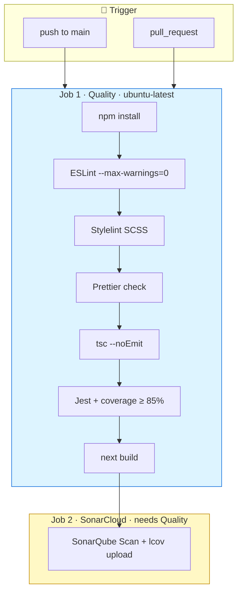
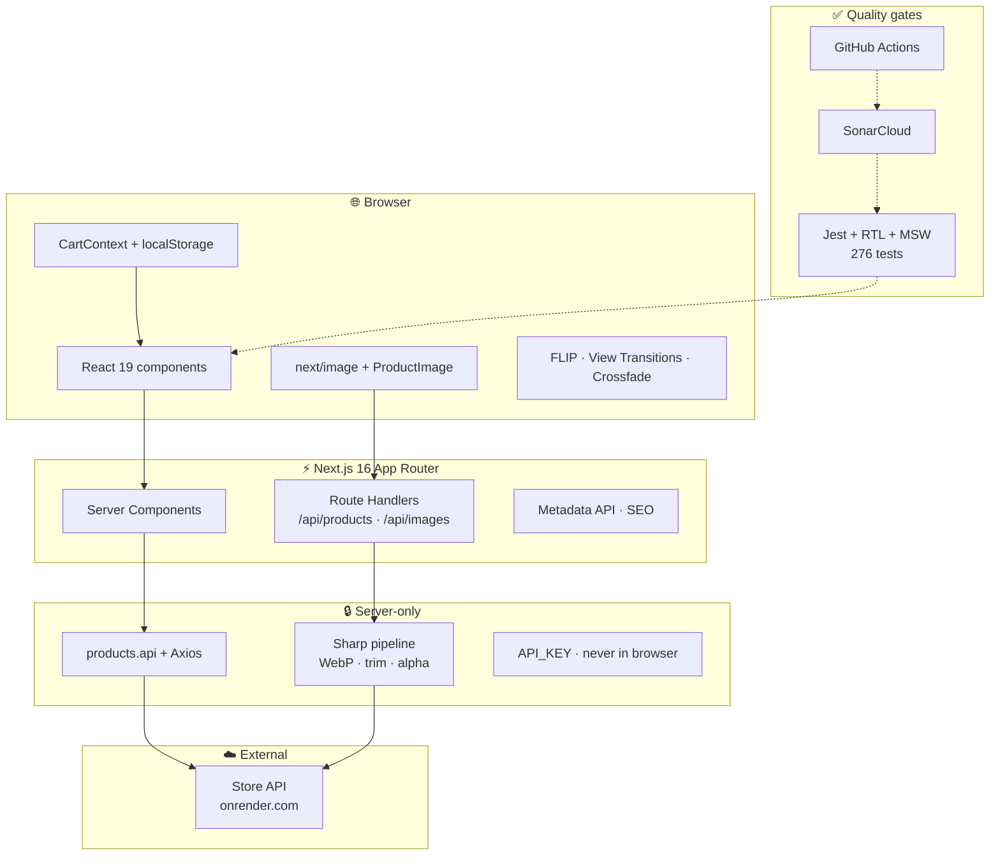

# Zara Mobile Catalog

<p align="center">
  <a href="https://github.com/CristinaFores/zara-mobile-challenge/actions/workflows/ci.yml"></a>
  <a href="https://sonarcloud.io/summary/new_code?id=CristinaFores_zara-mobile-challenge"></a>
</p>

<p align="center">
  <a href="https://sonarcloud.io/summary/new_code?id=CristinaFores_zara-mobile-challenge"></a>
</p>

<p align="center">
  <a href="https://sonarcloud.io/summary/new_code?id=CristinaFores_zara-mobile-challenge"></a>
  <a href="https://sonarcloud.io/summary/new_code?id=CristinaFores_zara-mobile-challenge"></a>
  <a href="https://sonarcloud.io/summary/new_code?id=CristinaFores_zara-mobile-challenge"></a>
  <a href="https://sonarcloud.io/summary/new_code?id=CristinaFores_zara-mobile-challenge"></a>
  <a href="https://sonarcloud.io/summary/new_code?id=CristinaFores_zara-mobile-challenge"></a>
</p>

<p align="center">
  
  
  
  
</p>

Production-grade mobile phone catalog for the Zara / Inditex technical challenge.
Browse, search, configure variants, and manage a persistent cart — with **strict linters,
GitHub Actions CI, and SonarCloud** on every pull request.

**Languages:** [English](./README.md) · [Español](./README.es.md)

---

## Linters & GitHub Actions

Every change is gated locally **and** in CI. Nothing merges without passing all checks.

### Linters (local + CI)

<p align="center">
  
  
  
  
  
</p>

| Tool           | Command                | Config              | What it enforces                                                   |
| -------------- | ---------------------- | ------------------- | ------------------------------------------------------------------ |
| **ESLint**     | `npm run lint`         | `eslint.config.mjs` | TS/React/Next rules, import order, `--max-warnings=0`              |
| **Stylelint**  | `npm run lint:styles`  | `.stylelintrc`      | SCSS BEM modules, no hardcoded colors (`declaration-strict-value`) |
| **Prettier**   | `npm run format:check` | `.prettierrc`       | Consistent formatting across TS/TSX/SCSS/JSON/MD                   |
| **TypeScript** | `npm run typecheck`    | `tsconfig.json`     | `strict` mode, no emit                                             |

**When they run**

| Stage                  | What runs                                                                                 |
| ---------------------- | ----------------------------------------------------------------------------------------- |
| **pre-commit** (Husky) | lint-staged → Prettier + ESLint fix on staged TS/TSX; Stylelint + Prettier on staged SCSS |
| **pre-push** (Husky)   | typecheck → lint → lint:styles → format:check → test → build                              |
| **GitHub Actions**     | Same gates + coverage + SonarCloud (see below)                                            |

### GitHub Actions CI

<p align="center">
  <a href="https://github.com/CristinaFores/zara-mobile-challenge/actions/workflows/ci.yml">
    
  </a>
</p>

Workflow: [`.github/workflows/ci.yml`](./.github/workflows/ci.yml) — triggers on **push** and **pull_request** to `main`.



| Job            | Steps                                                                          | Blocks merge |
| -------------- | ------------------------------------------------------------------------------ | ------------ |
| **Quality**    | install → ESLint → Stylelint → Prettier → typecheck → tests + coverage → build | ✅           |
| **SonarCloud** | full git history → coverage → static analysis                                  | ✅           |

**Secrets:** `API_KEY` (build step) · `SONAR_TOKEN` (Sonar job)

---

## Contents

|     | Section                                                           |
| --- | ----------------------------------------------------------------- |
| 🔍  | [Linters & GitHub Actions](#linters--github-actions)              |
| 📱  | [Product scope](#product-scope)                                   |
| 🔗  | [URL-driven state (query params)](#url-driven-state-query-params) |
| 🛒  | [Cart integrity](#cart-integrity)                                 |
| 🧱  | [Technology stack](#technology-stack--rationale)                  |
| 🖼️  | [Image pipeline & optimization](#image-pipeline--optimization)    |
| ✨  | [Motion & Figma fidelity](#motion--figma-fidelity)                |
| 🏗️  | [Architecture](#architecture)                                     |
| ✅  | [Quality engineering](#quality-engineering)                       |
| ♿  | [Accessibility & SEO](#accessibility--seo)                        |
| ⚡  | [Quick start](#quick-start)                                       |
| 📜  | [Scripts reference](#scripts-reference)                           |

---

## Product scope

| Surface | Route            | Behaviour                                                                                |
| ------- | ---------------- | ---------------------------------------------------------------------------------------- |
| Catalog | `/`              | Grid (limit 20), live search, result counter, FLIP list animations                       |
| Detail  | `/products/[id]` | Hero image, color/storage selectors, dynamic price, specs, similar products, add to cart |
| Cart    | `/cart`          | Line items, removal, running total, continue shopping                                    |

---

## URL-driven state (query params)

State that must survive refresh, back/forward, and shareable links is encoded in the URL.

### Catalog search — `/?search=`

| Concern        | Implementation                                                                                         |
| -------------- | ------------------------------------------------------------------------------------------------------ |
| Input debounce | 300 ms (`SEARCH_DEBOUNCE_MS`) before navigation                                                        |
| Server fetch   | Home reads `searchParams.search` and calls the API with `?search=` — **no client-side-only filtering** |
| URL sync       | Typing updates `/?search=<encoded>`; empty query clears the param                                      |
| History        | Back/forward restores the input via `initialQuery` sync without remounting the grid (FLIP preserved)   |

**Tests:** `useCatalogSearch.test.ts`, `page.test.tsx`, `ProductCatalog.test.tsx`, `SearchBar.test.tsx`

### Product configuration — `/products/[id]?color=&storage=`

| Concern     | Implementation                                                                                      |
| ----------- | --------------------------------------------------------------------------------------------------- |
| Read        | `useProductSelection` resolves `color` and `storage` from `useSearchParams()`                       |
| Write       | Selecting a chip calls `router.replace` with updated params (`scroll: false`)                       |
| Price       | `storageOptions[].price` drives the label; base price shown as "From X EUR" until storage is picked |
| Add to cart | Blocked until **both** params resolve to valid options                                              |
| Deep links  | Cart item links back with the same `color` + `storage` query string                                 |

**Tests:** `useProductSelection.test.ts`, `StorageSelector.test.tsx`, `ColorSelector.test.tsx`, `ProductDetailHero.test.tsx`

---

## Cart integrity

### Persistence and identity

- Items keyed by **product id + color + storage** (`buildKey`) — same phone, two configs = two lines.
- `localStorage` via `cartStorage` (SSR-safe, JSON validated on read, graceful fallback on quota/private mode).
- Hydration after mount; no storage access during server render.

### Updates

| Action     | Reducer                                                  | Tested                 |
| ---------- | -------------------------------------------------------- | ---------------------- |
| Add        | `ADD` — snapshot price from selected storage at add time | `CartContext.test.tsx` |
| Remove     | `REMOVE` by line key                                     | ✓                      |
| Clear      | `CLEAR`                                                  | ✓                      |
| Price sync | `SYNC_PRICES` + public `syncPrices(updates)`             | ✓                      |

**Price reconciliation:** each line stores the price chosen at add-to-cart. `syncPrices` accepts a map of line keys → current prices and recalculates `cartTotal`. Reducer and context behaviour are fully covered by BDD tests; wiring a cart-mount re-fetch against `GET /products/:id` is a thin integration step on top of this API.

**Stock / availability:** the challenge API exposes no inventory field. Availability is inferred as follows:

- Catalog: product appears in `GET /products` response.
- Detail: invalid or removed id → `ProductNotFoundError` / 404 path (`loadProduct`, `products.api` id validation).
- Cart: lines remain until the user removes them; `syncPrices` + optional re-fetch can flag stale configs when upstream data changes.

**Tests:** `CartContext.test.tsx`, `cartStorage.test.ts`, `buildKey.test.ts`, `CartView.test.tsx`

---

## Technology stack & rationale

### At a glance

<p align="center">
  <a href="https://nextjs.org"></a>
  <a href="https://react.dev"></a>
  <a href="https://www.typescriptlang.org"></a>
  <a href="https://sass-lang.com"></a>
  <a href="https://jestjs.io"></a>
  <a href="https://mswjs.io"></a>
  <a href="https://sharp.pixelplumbing.com"></a>
  <a href="https://sonarcloud.io"></a>
</p>



| Layer     | Technology                                                                                | Version | Why                                                                                                                         |
| --------- | ----------------------------------------------------------------------------------------- | ------- | --------------------------------------------------------------------------------------------------------------------------- |
| Framework | [Next.js](https://nextjs.org) App Router                                                  | 16      | SSR, metadata, route handlers, [`next/image`](https://nextjs.org/docs/app/building-your-application/optimizing/images), SEO |
| UI        | [React](https://react.dev)                                                                | 19      | Components, concurrent rendering, Next.js ecosystem                                                                         |
| Language  | [TypeScript](https://www.typescriptlang.org) strict                                       | 5.7     | Typed API contract, refactor safety, no `any`                                                                               |
| Styling   | [Sass](https://sass-lang.com) + BEM + CSS Modules                                         | —       | Scoped styles, [design tokens](./src/scss/_variables.scss), mobile-first                                                    |
| State     | Context API + reducer                                                                     | —       | Cart only — no Redux for this scope                                                                                         |
| HTTP      | [Axios](https://axios-http.com)                                                           | 1.18    | Isolated in [`products.api`](./src/shared/services/products.api.ts)                                                         |
| Images    | [Sharp](https://sharp.pixelplumbing.com) + [`/api/images`](./src/app/api/images/route.ts) | 0.34    | See [Image pipeline](#image-pipeline--optimization)                                                                         |
| Tests     | [Jest](https://jestjs.io) + [RTL](https://testing-library.com) + [MSW](https://mswjs.io)  | 30      | BDD tests; network at HTTP layer                                                                                            |
| Lint      | ESLint + Prettier + Stylelint                                                             | 9       | Zero-warning gate                                                                                                           |
| Hooks     | Husky + lint-staged                                                                       | 9 / 17  | pre-commit + pre-push                                                                                                       |
| CI        | [GitHub Actions](./.github/workflows/ci.yml) + [SonarCloud](https://sonarcloud.io)        | —       | Every PR fully gated                                                                                                        |
| E2E       | —                                                                                         | **WIP** | [Separate branch →](#e2e-tests--wip)                                                                                        |

**Intentionally omitted:** TanStack Query · Redux/Zustand · Tailwind.

Server-only env vars (never `NEXT_PUBLIC_`):

```env
API_BASE_URL=https://prueba-tecnica-api-tienda-moviles.onrender.com
API_KEY=your-api-key
```

---

## Image pipeline & optimization

> 🔗 Related: [Technology stack](#technology-stack--rationale) · [Motion & Figma](#motion--figma-fidelity) · [`ProductImage`](./src/shared/components/ProductImage/ProductImage.tsx) · [`imageProcessing.ts`](./src/shared/lib/imageProcessing.ts)

Upstream product images are remote, high-resolution, and often on a white background — bad for LCP, CLS, and the Figma look (transparent hero on grey).

### Why a server proxy (`/api/images`)

| Problem                               | Approach                                                                 |
| ------------------------------------- | ------------------------------------------------------------------------ |
| API key must stay server-side         | Browser never calls the store API for raw assets; proxy fetches upstream |
| SSRF risk                             | Host allowlist + protocol check on every request                         |
| Repeated Sharp work                   | In-process cache (~200 entries, keyed by url + width + quality)          |
| Slow onrender.com on every navigation | Cache-Control immutable + warm cache on repeat views                     |

### Pipeline (Sharp)

```mermaid
flowchart LR
  A["🖼️ Upstream PNG/WebP<br/>white background"] --> B["🔐 /api/images<br/>SSRF allowlist"]
  B --> C["📥 fetchRemoteImage"]
  C --> D["🎨 ensureAlpha"]
  D --> E["⬜ border flood-fill<br/>→ transparent"]
  E --> F["✂️ trim + resize"]
  F --> G["📦 WebP output"]
  G --> H["💾 cache 200 entries"]
  H --> I["⚡ next/image<br/>LCP eager"]

  style A fill:#f5f5f5,stroke:#333
  style G fill:#4ade80,stroke:#166534
  style I fill:#60a5fa,stroke:#1e40af
```



| Step                  | Purpose                                                                   |
| --------------------- | ------------------------------------------------------------------------- |
| Border flood-fill     | Removes edge-connected white; keeps internal whites (e.g. screen)         |
| Trim + contain        | Consistent card/hero framing per Figma                                    |
| WebP                  | Smaller payloads than source PNG/WebP from API                            |
| Concurrency limit (3) | Sharp stays below libuv thread-pool default — other I/O stays responsive  |
| Custom loader         | `ProductImage` routes every `src` through `buildProxyUrl` — one code path |

### Client-side (`next/image`)

- Responsive `sizes` per context (grid card vs detail hero vs similar products).
- Eager loading on above-the-fold catalog cards and detail hero (LCP).
- Fallback SVG silhouette on missing/broken `src` — crossfade still completes.
- `useColorVariantPreload` — prefetches other color URLs at 640 / 828 px before the user switches, reducing flash on variant change.

**Tests:** `ProductImage.test.tsx`, `imageProcessing.test.ts`, `app/api/images/route.test.ts`

---

## Motion & Figma fidelity

> 🔗 Related: [Image pipeline](#image-pipeline--optimization) · [`globals.scss`](./src/scss/globals.scss) · [Figma spec](https://www.figma.com/design/Nuic7ePgOfUQ0hcBrUUQrb/Labs---Zara-Web-Challenge--Smartphones-)

Animations follow the Figma challenge spec. All respect `prefers-reduced-motion: reduce` where the View Transitions API is used.

| Figma intent                   | Implementation                                                                      | Where                                              |
| ------------------------------ | ----------------------------------------------------------------------------------- | -------------------------------------------------- |
| Top loading bar on first paint | CSS animated bar, auto-dismiss ~1.2 s (static on cart page)                         | `Header`                                           |
| Grid reflow on search/filter   | FLIP technique — exiting cards animate out, entering cards slide from old positions | `useFlipAnimation`, `flip.ts`, `ProductList`       |
| Catalog → detail shared image  | View Transitions API + `viewTransitionName` on card image and detail hero           | `ProductCard`, `ProductDetailHero`, `globals.scss` |
| Instant hero while route loads | `loading.tsx` shows catalog preview image during transition                         | `app/products/[id]/loading.tsx`                    |
| Color change without flash     | Dual-slot opacity crossfade (`useImageCrossfade`)                                   | `ProductDetailHero`                                |
| Price / color name update      | Text crossfade (`useTextCrossfade`)                                                 | hero + `ColorSelector`                             |
| Similar products carousel      | Horizontal `ScrollRow` with drag scroll                                             | `SimilarProducts`                                  |
| Route transition timing        | Custom easing `cubic-bezier(0.22, 1, 0.36, 1)` ~520 ms on shared elements           | `globals.scss`                                     |

Navigation preview state (`productNavigation` store) keeps brand/name/image between catalog click and detail mount so the transition feels continuous.

**Tests:** `useFlipAnimation.test.tsx`, `flip.test.ts`, `useImageCrossfade.test.ts`, `useTextCrossfade.test.ts`, `loading.test.tsx`, `ProductCard.test.tsx`

---

## Architecture

Feature-based layout — domain by feature, shared cross-cutting code in `shared/`.

```
src/
├── app/                    Pages, layout, error/loading, route handlers
├── features/
│   ├── catalog/            Search, grid, FLIP, useCatalogSearch
│   ├── product-detail/     Hero, selectors, useProductSelection, crossfade
│   └── cart/               Context, reducer, CartView, cartStorage
├── shared/                 Components, services, lib, hooks, types, constants
├── scss/                   Tokens, reset, mixins
└── test-utils/             MSW handlers, fixtures
```

**Data flow**

- Server components call `products.service` → `products.api` → upstream API with `x-api-key`.
- Route handlers (`/api/products`, `/api/images`) reuse the same API layer.
- Client search pushes query params; server re-renders with fresh list.
- Detail selection pushes `color` / `storage` params; no duplicate client-only state.

---

## Quality engineering

Quality is a first-class deliverable, not an afterthought.

### Test suite

| Metric        | Value                                                                      |
| ------------- | -------------------------------------------------------------------------- |
| Runner        | Jest 30 + React Testing Library                                            |
| Style         | BDD — every `describe` / `it` follows Given → When → Then / And            |
| Network       | MSW v2 handlers in `src/test-utils/msw/handlers.ts`                        |
| Fixtures      | `src/test-utils/fixtures/products.fixtures.ts`                             |
| Suites        | 47 · 276 tests                                                             |
| Coverage gate | ≥ 85 % lines / functions / statements · ≥ 80 % branches (`jest.config.js`) |

**What we test (examples):**

- Search URL round-trip and debounced navigation
- Color/storage query param read/write and add-to-cart guard
- Cart add, remove, persistence, corrupt storage, `syncPrices` total recalculation
- API route handlers, image proxy, product id validation, `encodeURIComponent`
- FLIP animation idempotency, view-transition hooks, image crossfade
- Accessibility-facing labels, `aria-pressed`, live cart announcements

**Commands:**

```bash
npm run test
npm run test:coverage
```

Delivery gate:

```bash
npm run typecheck && npm run lint && npm run test && npm run build
```

### Static analysis — SonarCloud

| Item           | Detail                                                                  |
| -------------- | ----------------------------------------------------------------------- |
| Config         | `sonar-project.properties`                                              |
| Coverage input | `coverage/lcov.info` from `npm run test:coverage`                       |
| CI job         | `SonarCloud analysis` in `.github/workflows/ci.yml` (after quality job) |
| Secret         | `SONAR_TOKEN` in GitHub repository settings                             |
| Scope          | New code on pull requests; full analysis on `main`                      |

Sonar runs on every PR alongside ESLint (`--max-warnings=0`), Stylelint, Prettier, typecheck, tests, and production build. Live metrics are in the badge row at the top of this README.

### E2E tests — WIP

End-to-end tests are **planned on a separate branch** (not merged yet). See also [Test suite](#test-suite) · [SonarCloud](#static-analysis--sonarcloud).

| Planned scope                                        | Tool (TBD)            |
| ---------------------------------------------------- | --------------------- |
| Search → results update                              | Playwright or Cypress |
| Pick color + storage → add to cart → cart total      | —                     |
| Cart remove + persist after reload                   | —                     |
| Deep link with `?color=&storage=` restores selection | —                     |

Current coverage is **unit + integration** (Jest/RTL/MSW, 276 tests). E2E will complement — not replace — the existing suite.

### Local git hooks

| Hook       | Runs                                                         |
| ---------- | ------------------------------------------------------------ |
| pre-commit | lint-staged (Prettier + ESLint on TS/TSX, Stylelint on SCSS) |
| pre-push   | typecheck, lint, lint:styles, format:check, test, build      |

---

## Accessibility & SEO

- Semantic landmarks, one `h1` per page, Next.js metadata (dynamic titles on detail).
- Real buttons and links, `aria-pressed` on selectors, live region on cart add.
- Helvetica / Arial / sans-serif stack per spec.

---

## Quick start

**Requirements:** Node.js ≥ 20 · npm ≥ 10

```bash
npm install
cp .env.example .env.local
npm run dev
```

Open `http://localhost:3000`.

**Production:**

```bash
npm run build
npm run start
```

Deploy to any Node host or Vercel with the same server-side environment variables.

---

## Scripts reference

| Script                            | Purpose                       |
| --------------------------------- | ----------------------------- |
| `npm run dev`                     | Development server            |
| `npm run build` / `start`         | Production build and serve    |
| `npm run typecheck`               | `tsc --noEmit`                |
| `npm run lint`                    | ESLint, zero warnings allowed |
| `npm run lint:styles`             | Stylelint on SCSS             |
| `npm run format` / `format:check` | Prettier                      |
| `npm run test`                    | Jest                          |
| `npm run test:coverage`           | Jest + lcov for SonarCloud    |

---

**Summary:** Next.js for SEO and images · TypeScript strict · Sass + BEM · Context + localStorage cart ·
Sharp image proxy · Figma-aligned motion (FLIP, view transitions, crossfade) · URL query params ·
276 BDD tests + SonarCloud · E2E WIP on separate branch · accessibility and SEO as core requirements.
