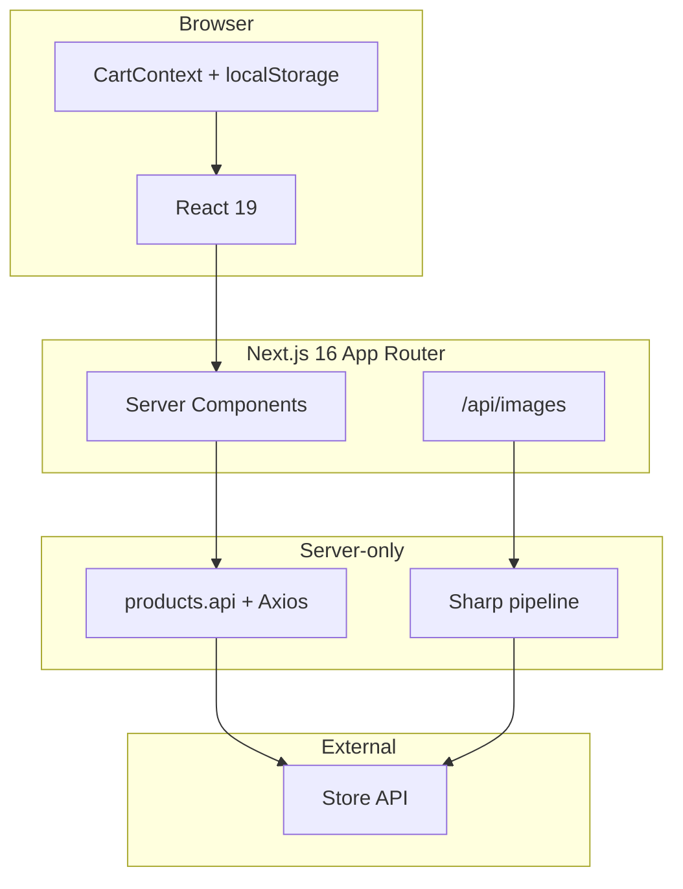
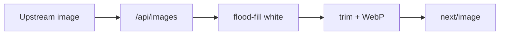
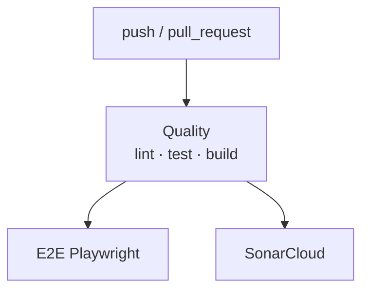

# Zara Mobile Catalog

|                                                                                         CI                                                                                          |                                                                              Sonar                                                                               |                                                     Tests                                                      |                                              Coverage gate                                              |                                                       TypeScript                                                       |                                                      ESLint                                                      |
| :---------------------------------------------------------------------------------------------------------------------------------------------------------------------------------: | :--------------------------------------------------------------------------------------------------------------------------------------------------------------: | :------------------------------------------------------------------------------------------------------------: | :-----------------------------------------------------------------------------------------------------: | :--------------------------------------------------------------------------------------------------------------------: | :--------------------------------------------------------------------------------------------------------------: |
| [](https://github.com/CristinaFores/zara-mobile-challenge/actions/workflows/ci.yml) | [](https://sonarcloud.io/summary/new_code?id=CristinaFores_zara-mobile-challenge) |  |  |  |  |

|                                                                                            Quality gate                                                                                             |                                                                                                  Coverage                                                                                                  |                                                                                                Bugs                                                                                                |                                                                                                   Code smells                                                                                                    |                                                                                                          Duplicated lines                                                                                                          |
| :-------------------------------------------------------------------------------------------------------------------------------------------------------------------------------------------------: | :--------------------------------------------------------------------------------------------------------------------------------------------------------------------------------------------------------: | :------------------------------------------------------------------------------------------------------------------------------------------------------------------------------------------------: | :--------------------------------------------------------------------------------------------------------------------------------------------------------------------------------------------------------------: | :--------------------------------------------------------------------------------------------------------------------------------------------------------------------------------------------------------------------------------: |
| [](https://sonarcloud.io/summary/new_code?id=CristinaFores_zara-mobile-challenge) | [](https://sonarcloud.io/summary/new_code?id=CristinaFores_zara-mobile-challenge) | [](https://sonarcloud.io/summary/new_code?id=CristinaFores_zara-mobile-challenge) | [](https://sonarcloud.io/summary/new_code?id=CristinaFores_zara-mobile-challenge) | [](https://sonarcloud.io/summary/new_code?id=CristinaFores_zara-mobile-challenge) |

Production-grade smartphone catalog for the [Napptilus Tech Labs](https://www.napptilus.com/) frontend challenge — **Zara Web Challenge**.
Browse, search, configure variants, and manage a persistent cart — with strict linters,
GitHub Actions CI, SonarCloud, and Playwright E2E on every pull request.

**Live:** [App](https://zara-mobile-challenge.vercel.app/) · [Delivery page](https://zara-mobile-challenge.vercel.app/entrega)

**Languages:** [English](./README.md) · [Español](./README.es.md) · [AGENTS.md](./AGENTS.md) · [DESIGN.md](./DESIGN.md)

---

## Contents

|                     |                                                                                                                                                  |
| ------------------- | ------------------------------------------------------------------------------------------------------------------------------------------------ |
| **Live**            | [App](https://zara-mobile-challenge.vercel.app/) · [Delivery page](https://zara-mobile-challenge.vercel.app/entrega)                             |
| **Getting started** | [Quick start](#quick-start) · [GitHub setup](#github-setup) · [Scripts](#scripts-reference)                                                      |
| **Application**     | [Product scope](#product-scope) · [URL state](#url-driven-state-query-params) · [Cart](#cart-integrity)                                          |
| **Architecture**    | [Stack](#technology-stack--rationale) · [Structure](#architecture) · [Images](#image-pipeline--optimization) · [Motion](#motion--figma-fidelity) |
| **Quality**         | [Testing](#quality-engineering) · [CI/CD](#cicd) · [E2E (Playwright)](#end-to-end-tests-playwright)                                              |
| **Other**           | [Accessibility & SEO](#accessibility--seo)                                                                                                       |

---

## Quick start

**Requirements:** Node.js ≥ 20 · npm ≥ 10

```bash
npm install
npm run playwright:install   # first time only — E2E browsers
cp .env.example .env.local     # fill API_KEY
npm run dev
```

Open [http://localhost:3000](http://localhost:3000).

| Mode             | Command                                                              |
| ---------------- | -------------------------------------------------------------------- |
| Development      | `npm run dev`                                                        |
| Production       | `npm run build && npm run start`                                     |
| Full local gate  | `npm run typecheck && npm run lint && npm run test && npm run build` |
| E2E (same as CI) | `npm run test:e2e -- --project=chromium`                             |

**GitHub (fork / new repo):** see [GitHub setup](#github-setup) for secrets and branch protection.

Server-only env vars (never `NEXT_PUBLIC_`):

```env
API_BASE_URL=https://prueba-tecnica-api-tienda-moviles.onrender.com
API_KEY=your-api-key
```

---

## Product scope

| Surface | Route            | Behaviour                                                                                |
| ------- | ---------------- | ---------------------------------------------------------------------------------------- |
| Catalog | `/`              | Grid (limit 20), live search, result counter, FLIP list animations                       |
| Detail  | `/products/[id]` | Hero image, color/storage selectors, dynamic price, specs, similar products, add to cart |
| Cart    | `/cart`          | Line items, removal, running total, continue shopping                                    |

---

## URL-driven state (query params)

State that must survive refresh, back/forward, and shareable links is encoded in the URL.

### Catalog search — `/?search=`

| Concern        | Implementation                                                                                         |
| -------------- | ------------------------------------------------------------------------------------------------------ |
| Input debounce | 300 ms (`SEARCH_DEBOUNCE_MS`) before navigation                                                        |
| Server fetch   | Home reads `searchParams.search` and calls the API with `?search=` — **no client-side-only filtering** |
| URL sync       | Typing updates `/?search=<encoded>`; empty query clears the param                                      |
| History        | Back/forward restores the input via `initialQuery` sync without remounting the grid (FLIP preserved)   |

**Tests:** `useCatalogSearch.test.ts`, `page.test.tsx`, `ProductCatalog.test.tsx`, `SearchBar.test.tsx`

### Product configuration — `/products/[id]?color=&storage=`

| Concern     | Implementation                                                                                      |
| ----------- | --------------------------------------------------------------------------------------------------- |
| Read        | `useProductSelection` resolves `color` and `storage` from `useSearchParams()`                       |
| Write       | Selecting a chip calls `router.replace` with updated params (`scroll: false`)                       |
| Price       | `storageOptions[].price` drives the label; base price shown as "From X EUR" until storage is picked |
| Add to cart | Blocked until **both** params resolve to valid options                                              |
| Deep links  | Cart item links back with the same `color` + `storage` query string                                 |

**Tests:** `useProductSelection.test.ts`, `StorageSelector.test.tsx`, `ColorSelector.test.tsx`, `ProductDetailHero.test.tsx`

---

## Cart integrity

### Persistence and identity

- Items keyed by **product id + color + storage** (`buildKey`) — same phone, two configs = two lines.
- `localStorage` via `cartStorage` (SSR-safe, JSON validated on read, graceful fallback on quota/private mode).
- Hydration after mount; no storage access during server render.

### Updates

| Action | Reducer                                                  | Tested                 |
| ------ | -------------------------------------------------------- | ---------------------- |
| Add    | `ADD` — snapshot price from selected storage at add time | `CartContext.test.tsx` |
| Remove | `REMOVE` by line key                                     | ✓                      |
| Clear  | `CLEAR`                                                  | ✓                      |

**Price behavior:** each line stores the price chosen at add-to-cart and keeps that snapshot in the cart.

**Future work (not implemented in this challenge):** real stock/availability management, checkout flow, and payment gateway integration.

**Tests:** `CartContext.test.tsx`, `cartStorage.test.ts`, `buildKey.test.ts`, `CartView.test.tsx`

---

## Technology stack & rationale

<p align="center">
  <a href="https://nextjs.org"></a>
  <a href="https://react.dev"></a>
  <a href="https://www.typescriptlang.org"></a>
  <a href="https://sass-lang.com"></a>
  <a href="https://jestjs.io"></a>
  <a href="https://playwright.dev"></a>
  <a href="https://sonarcloud.io"></a>
</p>



| Layer     | Technology                                                                                | Why                                                                 |
| --------- | ----------------------------------------------------------------------------------------- | ------------------------------------------------------------------- |
| Framework | [Next.js](https://nextjs.org) 16 App Router                                               | SSR, metadata, route handlers, `next/image`, SEO                    |
| UI        | [React](https://react.dev) 19                                                             | Components, Next.js ecosystem                                       |
| Language  | [TypeScript](https://www.typescriptlang.org) strict                                       | Typed API contract, no `any`                                        |
| Styling   | [Sass](https://sass-lang.com) + BEM + CSS Modules                                         | Scoped styles, [design tokens](./src/scss/_variables.scss)          |
| State     | Context API + reducer                                                                     | Cart only                                                           |
| HTTP      | [Axios](https://axios-http.com)                                                           | Isolated in [`products.api`](./src/shared/services/products.api.ts) |
| Images    | [Sharp](https://sharp.pixelplumbing.com) + [`/api/images`](./src/app/api/images/route.ts) | See [Image pipeline](#image-pipeline--optimization)                 |
| Tests     | Jest + RTL + MSW                                                                          | BDD; network at HTTP layer                                          |
| E2E       | [Playwright](https://playwright.dev)                                                      | Browser tests in `e2e/`                                             |
| CI        | GitHub Actions + SonarCloud                                                               | Every PR gated                                                      |

**Intentionally omitted:** TanStack Query · Redux/Zustand · Tailwind.

---

## Architecture

Feature-based layout — domain by feature, shared cross-cutting code in `shared/`.

```
src/
├── app/                    Pages, layout, error/loading, route handlers
├── features/
│   ├── catalog/            Search, grid, FLIP, useCatalogSearch
│   ├── product-detail/     Hero, selectors, useProductSelection, crossfade
│   └── cart/               Context, reducer, CartView, cartStorage
├── shared/                 Components, services, lib, hooks, types, constants
├── scss/                   Tokens, reset, mixins
└── test-utils/             MSW handlers, fixtures
```

**Data flow**

- Server components → `products.service` → `products.api` → upstream API with `x-api-key`.
- Route handler `/api/images` proxies and optimizes product images (Sharp).
- Client search pushes query params; server re-renders with fresh list.
- Detail selection pushes `color` / `storage` params; no duplicate client-only state.

---

## Image pipeline & optimization

Upstream product images are remote, high-resolution, and often on a white background — bad for LCP, CLS, and the Figma look (transparent hero on grey).

### Why a server proxy (`/api/images`)

| Problem                       | Approach                                                        |
| ----------------------------- | --------------------------------------------------------------- |
| API key must stay server-side | Browser never calls the store API for raw assets                |
| SSRF risk                     | Host allowlist + protocol check on every request                |
| Repeated Sharp work           | In-process cache (~200 entries, keyed by url + width + quality) |
| Slow upstream                 | Cache-Control immutable + warm cache on repeat views            |

### Pipeline (Sharp)



| Step                  | Purpose                                                   |
| --------------------- | --------------------------------------------------------- |
| Border flood-fill     | Removes edge-connected white; keeps internal whites       |
| Trim + contain        | Consistent card/hero framing per Figma                    |
| WebP                  | Smaller payloads than source                              |
| Concurrency limit (3) | Keeps libuv thread-pool responsive                        |
| Custom loader         | `ProductImage` routes every `src` through `buildProxyUrl` |

**Tests:** `ProductImage.test.tsx`, `imageProcessing.test.ts`, `app/api/images/route.test.ts`

---

## Motion & Figma fidelity

Animations follow the [Figma challenge spec](https://www.figma.com/design/Nuic7ePgOfUQ0hcBrUUQrb/Labs---Zara-Web-Challenge--Smartphones-). All respect `prefers-reduced-motion: reduce` where View Transitions API is used.

| Figma intent                  | Implementation          | Where                              |
| ----------------------------- | ----------------------- | ---------------------------------- |
| Top loading bar               | CSS animated bar ~1.2 s | `Header`                           |
| Grid reflow on search         | FLIP technique          | `useFlipAnimation`, `ProductList`  |
| Catalog → detail shared image | View Transitions API    | `ProductCard`, `ProductDetailHero` |
| Hero while route loads        | `loading.tsx` preview   | `app/products/[id]/loading.tsx`    |
| Color change without flash    | Stacked color layers    | `ProductDetailHero`                |
| Price / color name update     | Text crossfade          | `useTextCrossfade`                 |
| Similar products carousel     | Horizontal `ScrollRow`  | `SimilarProducts`                  |

**Tests:** `useFlipAnimation.test.tsx`, `flip.test.ts`, `loading.test.tsx`

---

## Quality engineering

### Unit & integration tests

| Metric        | Value                                                   |
| ------------- | ------------------------------------------------------- |
| Runner        | Jest 30 + React Testing Library                         |
| Style         | BDD — Given → When → Then / And                         |
| Network       | MSW v2 in `src/test-utils/msw/handlers.ts`              |
| Suites        | 48 · 270 tests                                          |
| Coverage gate | ≥ 85 % lines / functions / statements · ≥ 80 % branches |

```bash
npm run test
npm run test:coverage
```

### SonarCloud

| Item     | Detail                                            |
| -------- | ------------------------------------------------- |
| Config   | `sonar-project.properties`                        |
| Coverage | `coverage/lcov.info` from `npm run test:coverage` |
| CI job   | `SonarCloud analysis` after quality job           |
| Secret   | `SONAR_TOKEN` in GitHub settings                  |

---

## CI/CD

Every change is gated locally **and** in CI. Merge blocking requires [branch protection](#github-setup).

### Linters

<p align="center">
  
  
  
  
</p>

| Tool       | Command                | Config                                         |
| ---------- | ---------------------- | ---------------------------------------------- |
| ESLint     | `npm run lint`         | `eslint.config.mjs` — `--max-warnings=0`       |
| Stylelint  | `npm run lint:styles`  | `.stylelintrc` — SCSS BEM, no hardcoded colors |
| Prettier   | `npm run format:check` | `.prettierrc`                                  |
| TypeScript | `npm run typecheck`    | `tsconfig.json` — strict mode                  |

| Stage              | What runs                                                           |
| ------------------ | ------------------------------------------------------------------- |
| **pre-commit**     | lint-staged → Prettier + ESLint on staged TS/TSX; Stylelint on SCSS |
| **pre-push**       | typecheck → lint → lint:styles → format:check → test → build        |
| **GitHub Actions** | Same gates + coverage + E2E + SonarCloud                            |

### GitHub Actions

Workflow: [`.github/workflows/ci.yml`](./.github/workflows/ci.yml) — triggers on **push** and **pull_request** to `main`.



| Job                  | Steps                                            | Blocks merge\* |
| -------------------- | ------------------------------------------------ | -------------- |
| **Quality**          | lint → typecheck → tests + coverage → build      | ✅             |
| **E2E (Playwright)** | install browsers → `test:e2e --project=chromium` | ✅             |
| **SonarCloud**       | coverage → static analysis                       | ✅             |

\*Only when branch protection is enabled on `main`.

### Git hooks

| Hook       | Runs                                                    |
| ---------- | ------------------------------------------------------- |
| pre-commit | lint-staged (Prettier + ESLint + Stylelint)             |
| pre-push   | typecheck, lint, lint:styles, format:check, test, build |

---

## GitHub setup

One-time configuration for a new fork or repository:

**1. Secrets** — Settings → Secrets and variables → Actions

| Secret        | Used by                 |
| ------------- | ----------------------- |
| `API_KEY`     | Build + E2E (store API) |
| `SONAR_TOKEN` | SonarCloud job          |

**2. Branch protection** — Settings → Branches → Add rule for `main`

- ✅ Require a pull request before merging
- ✅ Require status checks to pass before merging
- Required checks (after CI runs once on a PR):
  - `Lint · Typecheck · Test · Build`
  - `E2E (Playwright)`
  - `SonarCloud analysis`

**3. SonarCloud** — import the repo at [sonarcloud.io](https://sonarcloud.io) and add `SONAR_TOKEN`.

Without branch protection, CI still runs on every PR but merges are not blocked automatically.

---

## End-to-end tests (Playwright)

Browser tests in `e2e/` exercise the real app against the live store API. They complement Jest/MSW — no axios mocking in E2E.

| Metric | Value                                                                           |
| ------ | ------------------------------------------------------------------------------- |
| Runner | Playwright 1.61                                                                 |
| Style  | BDD — `Given / When / Then` in every `test()` title                             |
| Config | [`playwright.config.ts`](./playwright.config.ts) — `chromium` + `mobile-chrome` |
| Specs  | 3 files · 23 scenarios per project · 46 total headless runs                     |

| File                  | Tests | Covers                                      |
| --------------------- | ----- | ------------------------------------------- |
| `e2e/listing.spec.ts` | 6     | Grid, search, navigate to detail            |
| `e2e/detail.spec.ts`  | 9     | Selectors, price, add to cart, back control |
| `e2e/cart.spec.ts`    | 8     | Lines, total, remove, persistence           |

**First-time setup**

```bash
npm run playwright:install
cp .env.example .env.local
```

**Commands**

| Goal                     | Command                                        |
| ------------------------ | ---------------------------------------------- |
| Full suite (recommended) | `npm run test:e2e`                             |
| Same as CI               | `npm run test:e2e -- --project=chromium`       |
| Watch in Chrome          | `npm run test:e2e:headed`                      |
| One file, step by step   | `npm run test:e2e:debug -- e2e/detail.spec.ts` |
| Interactive panel        | `npm run test:e2e:ui`                          |

E2E runs in GitHub Actions but **not** in Husky pre-push — run locally before opening a PR.

<details>
<summary><strong>E2E troubleshooting & debug tips</strong></summary>

**UI mode (`test:e2e:ui`)** — click ▶ in the left sidebar; nothing runs until you do. If trace zip fails: `rm -rf test-results playwright-report` and retry.

**Debug mode — blank browser?** — expected until you click ▶ Resume in the **Playwright Inspector** (not Chrome). Opens Inspector + Chrome paused at test start.

**Hydration warnings (`data-pw-cursor`)** — normal in debug mode only; headless and production builds are clean.

| Error                      | Fix                                     |
| -------------------------- | --------------------------------------- |
| `Executable doesn't exist` | `npm run playwright:install`            |
| Port 3000 busy             | `lsof -ti:3000 \| xargs kill -9`        |
| UI zip / truncated trace   | `rm -rf test-results playwright-report` |

</details>

---

## Accessibility & SEO

- Semantic landmarks, one `h1` per page, Next.js metadata (dynamic titles on detail).
- Real buttons and links, `aria-pressed` on selectors, live region on cart add.
- Helvetica / Arial / sans-serif stack per spec.

---

## Scripts reference

| Script                            | Purpose                       |
| --------------------------------- | ----------------------------- |
| `npm run dev`                     | Development server            |
| `npm run build` / `start`         | Production build and serve    |
| `npm run typecheck`               | `tsc --noEmit`                |
| `npm run lint` / `lint:styles`    | ESLint / Stylelint            |
| `npm run format` / `format:check` | Prettier                      |
| `npm run test` / `test:coverage`  | Jest / Jest + lcov            |
| `npm run playwright:install`      | Download Playwright Chromium  |
| `npm run test:e2e`                | E2E headless (all projects)   |
| `npm run test:e2e:headed`         | E2E headed, chromium          |
| `npm run test:e2e:debug`          | E2E with Playwright Inspector |
| `npm run test:e2e:ui`             | E2E interactive UI            |

---

**Summary:** Next.js · TypeScript strict · Sass + BEM · Context + localStorage cart · Sharp image proxy ·
Figma-aligned motion · URL query params · 270 BDD tests + SonarCloud + Playwright E2E · accessibility and SEO as core requirements.
